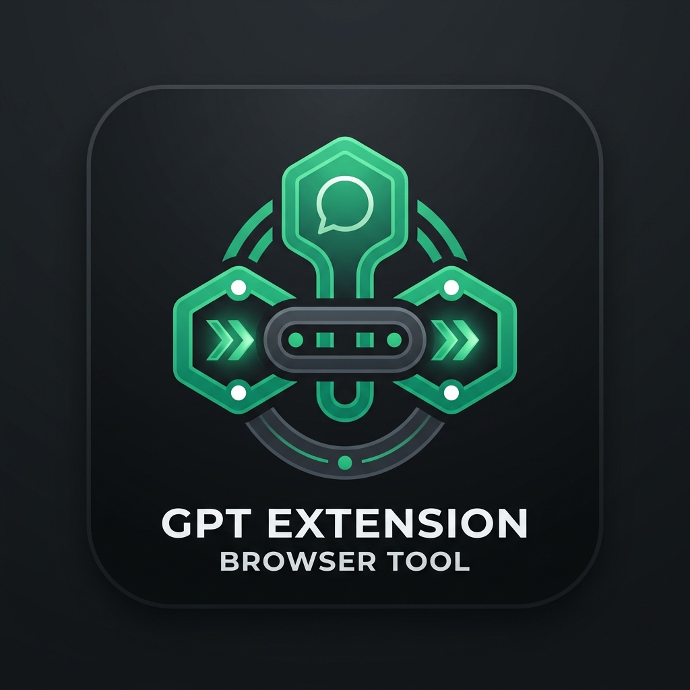

# ChatGPT Workspace Auto-Joiner

<p align="center">
  
</p>

<p align="center">
  <strong>A lightweight Chrome extension for learning how browser extensions can automate repeated workspace join requests on ChatGPT.</strong>
</p>

<p align="center">
  Made by <a href="https://github.com/ReysGG"><strong>ReysGG</strong></a>
</p>

<p align="center">
  
  
  
</p>

---

## ⚠️ Education Only

This project is provided **strictly for educational and research purposes**.

It is intended to demonstrate:

- how Chrome Extension Manifest V3 works,
- how browser extension popup/background scripts communicate,
- how authenticated browser sessions can be used by client-side tooling,
- how repetitive UI/API workflows can be studied in a controlled environment.

Do **not** use this project for spam, abuse, unauthorized access, bypassing platform rules, or any activity that violates ChatGPT/OpenAI terms, school/workspace policies, or applicable laws. You are responsible for how you use or modify this code.

---

## English

### Overview

**ChatGPT Workspace Auto-Joiner** is a Chrome extension that helps automate repeated join-request workflows for ChatGPT workspaces. It includes a simple popup UI, progress tracking, workspace target management, auth export helpers, and recovery tools for common workspace redirect loops.

The interface is intentionally minimal so the main action stays easy to access while advanced utilities remain tucked away.

### Features

- **One-click workspace join requests** for configured workspace IDs.
- **Progress tracking** with success/failure counts.
- **Simple popup UI** built with plain HTML, CSS, and JavaScript.
- **Multi-auth collection helper** for educational session/account inspection workflows.
- **Auth export helper** for local research/testing workflows.
- **Loop rescue tool** to clear local `chatgpt.com` data when stuck on workspace deactivation redirects.
- **Manifest V3 architecture** using a service worker background script.

### Project Structure

```txt
.
├── manifest.json          # Chrome extension manifest
├── popup.html             # Popup UI
├── popup.js               # Popup interactions and workspace list
├── background.js          # Background/service worker logic
├── content.js             # Content script for chatgpt.com pages
├── workspace_joiner.py    # Optional CLI helper script
├── icon.png               # Extension icon
└── README.md              # Project documentation
```

### Installation

1. Clone or download this repository.
2. Open Chrome or any Chromium-based browser.
3. Go to `chrome://extensions`.
4. Enable **Developer mode**.
5. Click **Load unpacked**.
6. Select this project folder.
7. Open `https://chatgpt.com` and make sure you are logged in.
8. Click the extension icon and use the popup.

### Usage Tutorial

> Only use this extension with workspace targets you are allowed to test or manage.

#### 1. Add Workspace IDs

Open `popup.js`, then add the workspace IDs you want to use inside `WORKSPACE_IDS`.

```js
const WORKSPACE_IDS = [
  "workspace-id-1",
  "workspace-id-2"
];
```

#### 2. Reload the Extension

After editing `popup.js`:

1. Open `chrome://extensions`.
2. Find **ChatGPT Workspace Auto-Joiner**.
3. Click the **Reload** button.

#### 3. Open ChatGPT

Go to:

```txt
https://chatgpt.com
```

Make sure you are logged in with the account you want to use for testing.

#### 4. Start Join Requests

1. Click the extension icon.
2. Press **Join Workspace**.
3. Wait until the progress box shows the final result.

The popup will show:

- how many workspace IDs were processed,
- how many requests succeeded,
- how many requests failed.

#### 5. Optional Tools

The popup also includes extra tools:

- **Loop Rescue** — clears local `chatgpt.com` data if ChatGPT gets stuck on a workspace redirect loop.
- **Multi Auth** — collects workspace/session-related data for educational inspection.
- **Auth Export** — exports active session auth data for local research/testing workflows.

Use these tools carefully. They depend on your active browser session.

### Configuration

Workspace IDs are configured in `popup.js`:

```js
const WORKSPACE_IDS = [
  "workspace-id-here"
];
```

Add new IDs to the list and reload the extension from `chrome://extensions`.

### Notes

- The extension only runs on `https://chatgpt.com/*`.
- It depends on the current browser session.
- If ChatGPT changes internal endpoints or page behavior, parts of the extension may stop working.
- This repository does not include any tokens, credentials, or private workspace access.

---

## Bahasa Indonesia

### Ringkasan

**ChatGPT Workspace Auto-Joiner** adalah ekstensi Chrome untuk membantu mempelajari otomatisasi request join ke beberapa workspace ChatGPT. Project ini punya UI popup sederhana, progress tracking, daftar target workspace, helper export auth, dan tool recovery kalau ChatGPT stuck redirect ke halaman workspace deactivated.

Tampilan dibuat minimal supaya tombol utama mudah dipakai, sementara fitur tambahan tetap tersedia dalam dropdown.

### Fitur

- **Request join workspace sekali klik** untuk daftar workspace ID yang sudah dikonfigurasi.
- **Progress tracking** dengan jumlah berhasil/gagal.
- **UI popup sederhana** menggunakan HTML, CSS, dan JavaScript biasa.
- **Helper multi-auth collection** untuk kebutuhan belajar dan inspeksi session/account.
- **Helper auth export** untuk riset/testing lokal.
- **Loop rescue tool** untuk clear data lokal `chatgpt.com` kalau stuck redirect.
- **Arsitektur Manifest V3** dengan background service worker.

### Struktur Project

```txt
.
├── manifest.json          # Manifest ekstensi Chrome
├── popup.html             # Tampilan popup
├── popup.js               # Interaksi popup dan daftar workspace
├── background.js          # Logic background/service worker
├── content.js             # Content script untuk halaman chatgpt.com
├── workspace_joiner.py    # Script CLI opsional
├── icon.png               # Icon ekstensi
└── README.md              # Dokumentasi project
```

### Cara Install

1. Clone atau download repository ini.
2. Buka Chrome atau browser berbasis Chromium.
3. Masuk ke `chrome://extensions`.
4. Aktifkan **Developer mode**.
5. Klik **Load unpacked**.
6. Pilih folder project ini.
7. Buka `https://chatgpt.com` dan pastikan sudah login.
8. Klik icon ekstensi lalu gunakan popup.

### Tutorial Penggunaan

> Gunakan ekstensi ini hanya untuk workspace yang memang kamu punya izin untuk test atau kelola.

#### 1. Tambahkan Workspace ID

Buka `popup.js`, lalu masukkan workspace ID yang ingin digunakan ke dalam `WORKSPACE_IDS`.

```js
const WORKSPACE_IDS = [
  "workspace-id-1",
  "workspace-id-2"
];
```

#### 2. Reload Ekstensi

Setelah mengedit `popup.js`:

1. Buka `chrome://extensions`.
2. Cari **ChatGPT Workspace Auto-Joiner**.
3. Klik tombol **Reload**.

#### 3. Buka ChatGPT

Masuk ke:

```txt
https://chatgpt.com
```

Pastikan kamu sudah login dengan akun yang ingin digunakan untuk testing.

#### 4. Jalankan Join Request

1. Klik icon ekstensi.
2. Tekan tombol **Join Workspace**.
3. Tunggu sampai progress box menampilkan hasil akhir.

Popup akan menampilkan:

- berapa workspace ID yang diproses,
- berapa request yang berhasil,
- berapa request yang gagal.

#### 5. Tool Tambahan

Popup juga punya beberapa tool tambahan:

- **Loop Rescue** — clear data lokal `chatgpt.com` kalau ChatGPT stuck redirect ke workspace deactivated.
- **Multi Auth** — mengumpulkan data workspace/session untuk kebutuhan inspeksi edukatif.
- **Auth Export** — export data auth session aktif untuk riset/testing lokal.

Gunakan tool tambahan ini dengan hati-hati karena bergantung pada session browser yang sedang aktif.

### Konfigurasi

Daftar workspace ID ada di `popup.js`:

```js
const WORKSPACE_IDS = [
  "workspace-id-di-sini"
];
```

Tambahkan ID baru ke list tersebut, lalu reload ekstensi dari `chrome://extensions`.

### Catatan

- Ekstensi hanya berjalan di `https://chatgpt.com/*`.
- Ekstensi memakai session browser yang sedang login.
- Jika ChatGPT mengubah endpoint internal atau struktur halaman, beberapa fitur bisa berhenti bekerja.
- Repository ini tidak menyertakan token, credential, atau akses private workspace apa pun.

---

## Responsible Use

By using this project, you agree to use it only in environments where you have permission. Keep testing controlled, respect platform rules, and do not use automation to harass, spam, overload, or access systems/workspaces without authorization.
